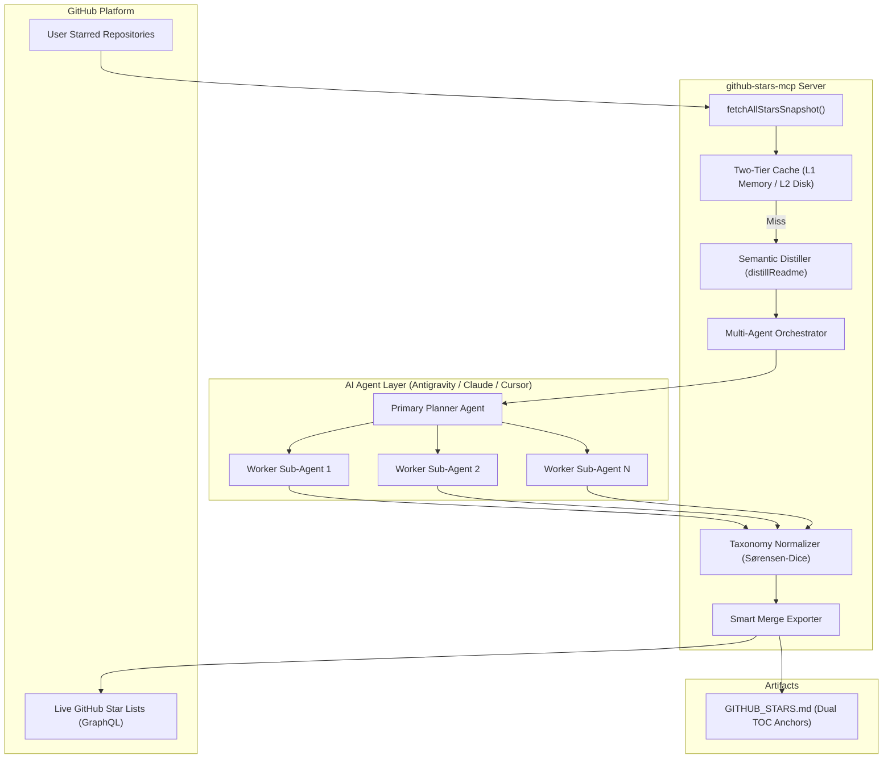

# GitHub Stars MCP (`github-stars-mcp`)

[](https://opensource.org/licenses/MIT)
[](https://nodejs.org/)
[](https://modelcontextprotocol.io/)
[](./test_audit_fixes_regression.js)
[](./GITHUB_STARS.md)

> A production-grade, context-window-aware **Model Context Protocol (MCP)** server that organizes your GitHub starred repositories using AI agents, creates curated markdown catalogs with non-destructive merge, and synchronizes directly with native GitHub Star Lists.

---

## 💡 Why This Exists: The "Star Graveyard"

Most developers have dozens or hundreds of starred repositories on GitHub that sit completely unused:
- **No Search by Concept**: GitHub search only matches exact words. Searching for *"local embedding model"* won't find a repo titled *"fast-sentence-bert"*.
- **Context Window Exhaustion**: Trying to feed 70+ full README files directly into an LLM blows past context limits and incurs heavy token costs.
- **Data Loss on Updates**: Re-running generic organization scripts often wipes personal notes, destroys custom tags, or creates duplicate lists.
- **Rate-Limiting & Drift**: Fast concurrent API calls hit GitHub secondary rate limits (HTTP 403/429) or suffer from index drift when new stars are added mid-run.

**GitHub Stars MCP** solves all of these problems with an enterprise-grade, resilient Map-Reduce pipeline.

---

## ⚡ Key Features

- 🧠 **Multi-Agent Map-Reduce Pipeline**: Freezes an immutable snapshot of all starred repos at initialization (`github_orchestrate_workers`), slices them into deterministic worker chunks (`github_get_worker_chunk`), and collects results into a unified session (`github_submit_worker_digest`) with zero pagination drift.
- 🧹 **Semantic README Distillation**: Cleanses raw documentation by stripping badges, images, SVGs, license blocks, and tables while strictly preserving centered hero text, elevator pitches, and core architectural concepts.
- ⚡ **Two-Tier Caching (Memory + Disk)**: L1 in-memory + L2 disk cache. Incremental runs process newly starred repositories in milliseconds, consuming zero API rate limits for existing stars.
- 🛡️ **Non-Destructive Smart Merge**: Automatically detects existing [`GITHUB_STARS.md`](./GITHUB_STARS.md) files. Appends new stars, updates table-of-contents badges, and **strictly preserves user manual notes** (`> **User Note:**`) and custom annotations.
- 🔄 **Live GitHub Star Lists Synchronization**: Directly interacts with GitHub's GraphQL API to create canonical category lists on `github.com/stars/<user>/lists` and assign repositories to them with atomic batch mutations.
- 🛡️ **Production Resilience Layer**:
  - **Exponential Backoff with Jitter**: Automatically catches and retries transient HTTP 403, 429, and socket reset errors.
  - **Empty / Missing README Fallback**: Synthesizes structured context from repository descriptions, languages, and topics if a repository lacks a README.
  - **Windows Atomic File Writes**: Uses temporary files with atomic rename and retry backoff to eliminate Windows `EBUSY` file locking errors under concurrent sub-agent access.
  - **Security Hardening**: Strict workspace sandboxing (CWE-22 path traversal defense) and prototype collision protection (CWE-1321).

---

## 📐 Architecture & Flow



---

## 🚀 Quickstart & Installation

### 1. Prerequisites
- **Node.js**: v18.0.0 or higher
- **GitHub Authentication**: Either the [GitHub CLI (`gh`)](https://cli.github.com/) authenticated with `user` scope:
  ```bash
  gh auth login -s user,repo
  ```
  *OR* a personal access token set in your environment:
  ```bash
  export GITHUB_PERSONAL_ACCESS_TOKEN="ghp_yourTokenHere"
  # On Windows PowerShell:
  $env:GITHUB_PERSONAL_ACCESS_TOKEN="ghp_yourTokenHere"
  ```

### 2. Clone and Install Dependencies
```bash
git clone https://github.com/SalAkBuK/github-stars-mcp.git
cd github-stars-mcp
npm install
```

---

## 🔌 Connecting to AI Coding Assistants

### Claude Desktop
Add this to your `claude_desktop_config.json` (`%APPDATA%\Claude\claude_desktop_config.json` on Windows or `~/Library/Application Support/Claude/claude_desktop_config.json` on macOS):

```json
{
  "mcpServers": {
    "github-stars": {
      "command": "node",
      "args": ["/absolute/path/to/github-stars-mcp/index.js"]
    }
  }
}
```

### Antigravity / Cursor / Cline (`mcp_config.json`)
```json
{
  "mcpServers": {
    "github-stars": {
      "command": "node",
      "args": ["/absolute/path/to/github-stars-mcp/index.js"],
      "env": {
        "GITHUB_PERSONAL_ACCESS_TOKEN": "ghp_yourTokenHere"
      }
    }
  }
}
```

---

## 🛠️ MCP Tool Reference

| Tool Name | Type | Description |
|---|---|---|
| `github_orchestrate_workers` | **Orchestration** | Freezes a static star snapshot, computes optimal chunk sizes, and returns prompt plans for parallel workers. |
| `github_get_worker_chunk` | **Worker** | Returns an assigned slice of repositories with pre-distilled READMEs and token budgets. |
| `github_submit_worker_digest` | **Worker** | Ingests analyzed repositories, normalizes category names, and updates the orchestration session. |
| `github_get_orchestration_status` | **Monitoring** | Checks completion status, active worker state machines, and catalog progress. |
| `github_force_reduce_session` | **Resilience** | Reassigns failed workers or forces compilation from completed chunks if a worker times out. |
| `github_export_catalog` | **Catalog** | Generates or merges [`GITHUB_STARS.md`](./GITHUB_STARS.md) with Table of Contents, tags, and preserved notes. |
| `github_get_user_lists` | **Live Sync** | Fetches native user star lists from `github.com/stars/<user>/lists`. |
| `github_create_user_list` | **Live Sync** | Creates a new native GitHub Star List via GraphQL mutation. |
| `github_assign_repo_to_lists` | **Live Sync** | Assigns repositories to one or more GitHub Star Lists on github.com. |
| `github_batch_get_starred_with_readme` | **Batch Read** | Fetches a batch of starred repos with distilled READMEs for single-agent workflows. |
| `github_get_readme` | **Read** | Fetches and distills a single repository's README. |
| `github_list_starred` | **Read** | Lists starred repositories with pagination, stars count, and topics. |
| `github_get_user_info` | **Info** | Returns authenticated username and total star count. |
| `github_clear_cache` | **Maintenance** | Flushes in-memory and disk caches. |

---

## 📂 Canonical Baseline Taxonomy

The default taxonomy is calibrated to cover software development domains without category explosion:

1. **`AI & Agent Infrastructure`**: Agent harnesses, LLM toolkits, MCP servers, and prompt frameworks.
2. **`Developer Tools & CLI`**: Terminals, build tools, editors, and modern developer utilities.
3. **`System Design & Backend Architecture`**: Distributed systems, network proxies, games, and backend engines.
4. **`Frontend & UI Libraries`**: Component libraries, design systems, icons, and UI primitives.
5. **`Databases & Data Engineering`**: Embedded databases, SQL engines, and analytical storage.
6. **`Security & Reverse Engineering`**: Decompilers, secret scanners, static analyzers, and offensive tooling.
7. **`Educational & Roadmaps`**: CS fundamentals, interview guides, and engineering primers.
8. **`Inspiration & Creative Ideas`**: Creative experiments, hardware drivers, and retro simulators.

---

## 🧪 Running the Test Suite

The repository includes comprehensive unit and integration test batteries covering regression fixes, rate limiting, and atomic disk writes:

```bash
# Run core regression & audit suites
npm test

# Run multi-agent resilience & concurrency tests
npm run test:resilience

# Test live GitHub list sync script
npm run sync
```

---

## 📜 License

This project is licensed under the **MIT License**. See the [LICENSE](./LICENSE) file for details.
